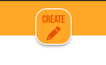
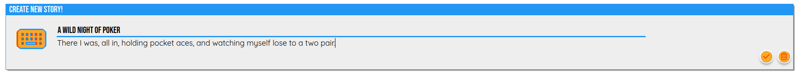
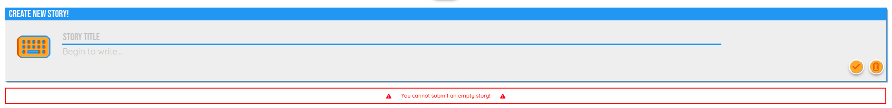
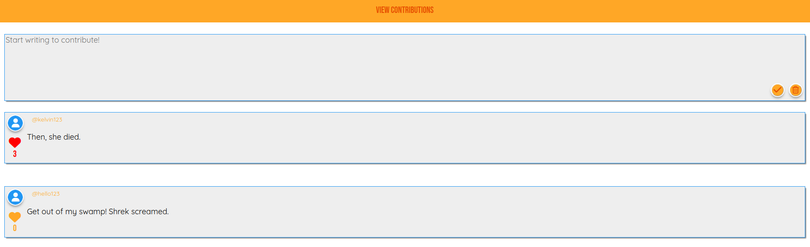
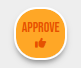
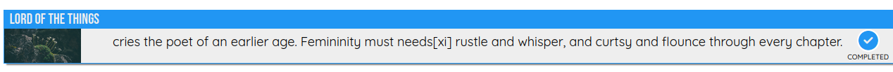

<!-- PROJECT LOGO -->
<div align="center">


# WeStory

<div align="center">
  A collaborative story writting app, where users can author a story with collaberation from users.
  <div>
    <a href="https://github.com/TeaBizzy/WeStory/issues">Report Bug</a>
    ·
    <a href="https://github.com/TeaBizzy/WeStory/issues">Request Feature</a>
  </div>
</div>
<br />

<!-- ABOUT THE PROJECT -->
## About The Project

---
### Built With

<a href="https://expressjs.com/">Express</a> : 
<a href="https://sass-lang.com/">Sass</a> : 
<a href="https://jquery.com/">jQuery</a> :
<a href="https://ejs.co/">EJS</a>

<div align="left">

---

<!-- GETTING STARTED -->
## Getting Started

### Prerequisites

* npm
* node

### Installation

1. Clone the repo
   ```sh
   git clone https://github.com/TeaBizzy/WeStory.git
   ```
2. Install NPM packages
   ```sh
   npm install
   ```
2. Reset database
   ```sh
   npm run db:reset
   ```

### Accessing the Website

1. Start the server
   ```sh
   npm run local
   ```
2. Open your browser, and enter the following url
   ```
   http://localhost:8080/
   ```
3. Login by visiting the following URL. You can login with numbers 1-3
   ```
   http://localhost:8080/login/1
   ```

---
<!-- USAGE EXAMPLES -->
## Usage

### Start A New Story
* Click the Create button to display the text box.

  

* Compose a story of 1-160 characters long, and click the orange checkmark to submit!

  

* If a story is invalid an error will appear.

  

---

### Write / Accept Contributions

* Contributions have the same limitations as a new story, and the creation form is very similar.

  

* As the author of the story, you will see accept buttons on contributions. Clicking this will add the contribution to the story.

  

---

### Finishing A Story

* Authors can 'lock' a story they own at any time by clicking the 'Finish' button on their story.

  

* Completing a story will remove all pending contributions, and prevent contributions from being created. The story will be marked as completed for other users to see.

  

---

<!-- CONTACT -->
## Contact

Kelvin Huang - https://github.com/kelvinhuang98<br>
Ruoning Jin - https://github.com/RuoningJin<br>
Stefan Talbot - https://github.com/TeaBizzy<br>

Project Link: [https://github.com/TeaBizzy/WeStory](https://github.com/TeaBizzy/WeStory)

---

<!-- ACKNOWLEDGMENTS -->
## Acknowledgments

* [Light House Labs](https://www.lighthouselabs.ca/)
